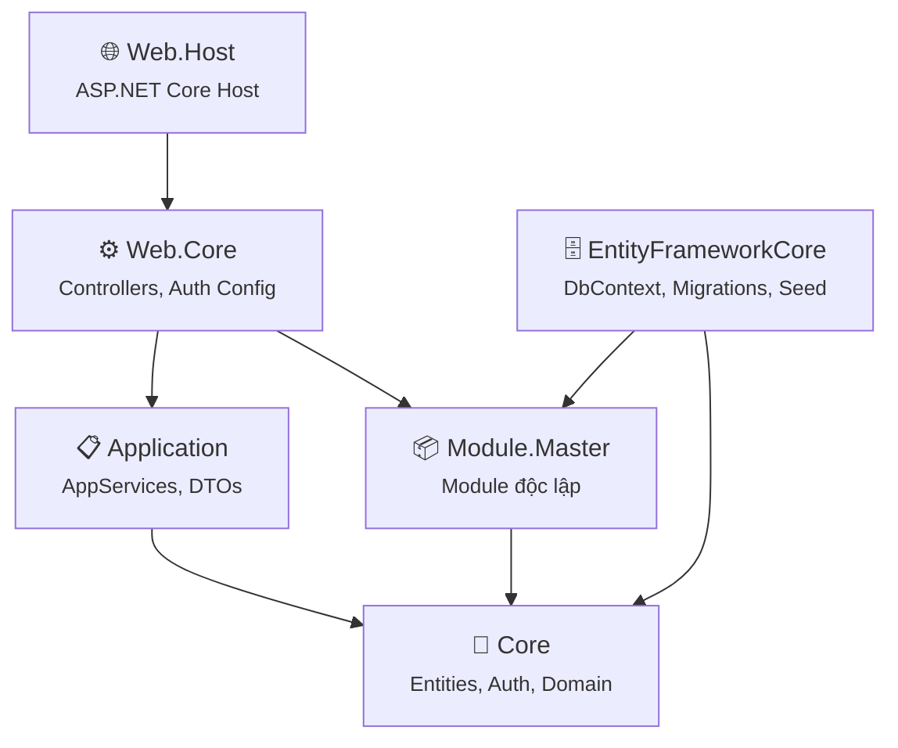

# HUDI.CoreX – Kiến Trúc & Hướng Dẫn Code

## 1. Tổng Quan

HUDI.CoreX là ứng dụng web dựa trên **ABP Framework (ASP.NET Boilerplate)** v9.4.1, .NET 8.0 với Angular 18 frontend.

```
HUDI.CoreX/
├── aspnet-core/           # Backend
│   ├── src/               # Source code chính
│   └── Module/            # Các module độc lập
└── angular/               # Frontend Angular 18
```

---

## 2. Kiến Trúc Backend (N-tier)



### Các Project

| Project | Vai trò | Chứa |
|---------|---------|------|
| **Core** | Domain Layer | Entities, Authorization (PermissionNames, AuthProvider), Localization, Consts |
| **Application** | Application Layer | AppServices, DTOs, AutoMapper Profiles |
| **EntityFrameworkCore** | Data Access | DbContext, Migrations, Seed Data |
| **Web.Core** | Web Configuration | Module registration, JWT config, Controller routing |
| **Web.Host** | Entry Point | Startup, Program.cs, appsettings |
| **Migrator** | DB Migration Tool | Console app chạy migration |
| **Module.Master** | Module độc lập | MasterData entity, AppService, DTOs, Authorization |

---

## 3. Kiến Trúc Frontend (Angular 18)

```
angular/src/
├── app/
│   ├── layout/              # Sidebar menu, header
│   ├── roles/               # CRUD Roles (PrimeNG Tree permissions)
│   ├── users/               # CRUD Users
│   ├── tenants/             # CRUD Tenants
│   ├── master-data/         # CRUD Master Data Dictionary
│   ├── home/                # Dashboard
│   └── about/               # About page
├── shared/
│   ├── service-proxies/     # Auto-generated API proxies (NSwag)
│   ├── primeng.module.ts    # PrimeNG component imports
│   ├── layout/              # MenuItem model
│   └── auth/                # Auth guard, Auth service
└── account/                 # Login, Register
```

**Tech stack Frontend:** Angular 18, PrimeNG, ngx-bootstrap, AdminLTE layout.

---

## 4. Hệ Thống Phân Quyền (Cây)

```
📁 Pages
├── 📁 Administration
│   ├── Tenants           (Host only)
│   ├── Users
│   │   └── Users.Activation
│   └── Roles
└── 📁 MasterData
    └── Dictionary
        ├── Create
        ├── Edit
        └── Delete
```

- **Backend:** Định nghĩa trong `PermissionNames.cs` + `AuthorizationProvider`
- **Frontend:** Route guard (`data: { permission: '...' }`), `*ngIf="isGranted('...')"`, menu `visible`

---

## 5. Hướng Dẫn Tạo Module Mới

### Bước 1: Tạo Project Module

```
aspnet-core/Module/HUDI.CoreX.Module.{TenModule}/
├── HUDI.CoreX.Module.{TenModule}.csproj
├── CoreX{TenModule}Module.cs           # ABP Module class
├── Authorization/
│   ├── {TenModule}PermissionNames.cs   # Permission constants
│   └── {TenModule}AuthorizationProvider.cs
└── {Feature}/
    ├── {Entity}.cs                     # Entity
    ├── I{Entity}AppService.cs          # Interface
    ├── {Entity}AppService.cs           # Implementation
    └── Dto/
        ├── {Entity}Dto.cs
        ├── Create{Entity}Dto.cs
        ├── Update{Entity}Dto.cs
        ├── {Entity}MapProfile.cs       # AutoMapper
        └── Paged{Entity}ResultRequestDto.cs
```

### Bước 2: Đăng ký Module

**`HUDI.CoreX.Module.{TenModule}.csproj`:**
```xml
<Project Sdk="Microsoft.NET.Sdk">
  <PropertyGroup>
    <TargetFramework>net8.0</TargetFramework>
  </PropertyGroup>
  <ItemGroup>
    <ProjectReference Include="..\..\src\HUDI.CoreX.Core\HUDI.CoreX.Core.csproj" />
  </ItemGroup>
</Project>
```

**Module class:**
```csharp
[DependsOn(typeof(CoreXCoreModule), typeof(AbpAutoMapperModule))]
public class CoreX{TenModule}Module : AbpModule
{
    public override void Initialize()
    {
        IocManager.RegisterAssemblyByConvention(typeof(CoreX{TenModule}Module).GetAssembly());
        Configuration.Modules.AbpAutoMapper().Configurators.Add(cfg =>
            cfg.AddMaps(typeof(CoreX{TenModule}Module).GetAssembly())
        );
    }
}
```

**Đăng ký trong `CoreXWebCoreModule.cs`:**
```csharp
[DependsOn(typeof(CoreX{TenModule}Module))]  // Thêm DependsOn

// Trong PreInitialize():
Configuration.Modules.AbpAspNetCore().CreateControllersForAppServices(
    typeof(CoreX{TenModule}Module).GetAssembly()
);
```

**Thêm ProjectReference** vào `EntityFrameworkCore.csproj` và `Web.Core.csproj`.

### Bước 3: Thêm DbSet

```csharp
// Trong CoreXDbContext.cs:
public DbSet<YourEntity> YourEntities { get; set; }
```

### Bước 4: Tạo Migration

```bash
dotnet ef migrations add "Added_{Entity}" -p src/HUDI.CoreX.EntityFrameworkCore -s src/HUDI.CoreX.Web.Host
dotnet ef database update -p src/HUDI.CoreX.EntityFrameworkCore -s src/HUDI.CoreX.Web.Host
```

---

## 6. Hướng Dẫn Thêm Permission

### Backend

**1. Định nghĩa constants:**
```csharp
// {Module}PermissionNames.cs
public const string Pages_{Feature} = "Pages.{Feature}";
public const string Pages_{Feature}_Create = "Pages.{Feature}.Create";
```

**2. Đăng ký provider:**
```csharp
// {Module}AuthorizationProvider.cs
var pages = context.GetPermissionOrNull(PermissionNames.Pages)
            ?? context.CreatePermission(PermissionNames.Pages, L("Pages"));
var feature = pages.CreateChildPermission(...);
feature.CreateChildPermission(..._Create, L("Create"));
```

**3. Gán vào AppService:**
```csharp
[AbpAuthorize(PermissionNames.Pages_{Feature})]
public class YourAppService : AsyncCrudAppService<...>
{
    public YourAppService(IRepository<...> repo) : base(repo)
    {
        CreatePermissionName = "Pages.{Feature}.Create";
        UpdatePermissionName = "Pages.{Feature}.Edit";
        DeletePermissionName = "Pages.{Feature}.Delete";
    }
}
```

### Frontend

```html
<!-- Ẩn nút theo quyền -->
<p-button *ngIf="isGranted('Pages.{Feature}.Create')" ...></p-button>
```

```typescript
// Route guard
{ path: 'feature', data: { permission: 'Pages.{Feature}' }, canActivate: [AppRouteGuard] }

// Sidebar menu
new MenuItem('Feature', '/app/feature', 'fas fa-icon', 'Pages.{Feature}')
```

---

## 7. Localization (Đa ngôn ngữ)

**File:** `src/HUDI.CoreX.Core/Localization/SourceFiles/`

| File | Ngôn ngữ |
|------|----------|
| `CoreX.xml` | English (mặc định) |
| `CoreX-vi.xml` | Tiếng Việt |

**Thêm key mới:**
```xml
<!-- CoreX.xml -->
<text name="MyKey">English value</text>

<!-- CoreX-vi.xml -->
<text name="MyKey">Giá trị tiếng Việt</text>
```

**Sử dụng:**
```csharp
// Backend
L("MyKey")

// Frontend (Angular)
{{ "MyKey" | localize }}
```

---

## 8. Service Proxies (Frontend ↔ Backend)

Service proxies tự sinh từ Swagger bằng **NSwag**:

```bash
# Trong angular/:
npx nswag run nswag.json
```

File output: `src/shared/service-proxies/service-proxies.ts`

> ⚠️ **Không sửa thủ công file này** – chạy lại NSwag sau khi thay đổi backend API.

---

## 9. Database

- **DBMS:** PostgreSQL
- **ORM:** Entity Framework Core 8
- **Migrations:** Code-first

**Connection string:** `appsettings.json` trong `Web.Host`:
```json
{
  "ConnectionStrings": {
    "Default": "Host=...;Database=...;Username=...;Password=..."
  }
}
```
